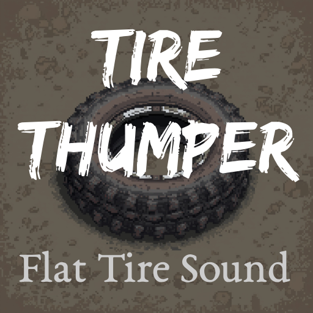

# Tire Thumper

A [Project Zomboid](https://projectzomboid.com) Build 42 mod that plays rhythmic thumping sounds when you drive on a flat tire.

Experience that sinking feeling as the thumping gets faster and louder the harder you push it.

## Features

- Triggers only when pressure is genuinely low — not just slightly off
- Thump frequency and volume increase with speed
- Quieter when zoomed out — louder when zoomed in close to your vehicle
- 6 unique audio samples, randomly selected each thump for a natural feel
- Works in multiplayer — client-side only, no server required

## How It Works

Every tick, the mod checks whether you are:
- Driving (not a passenger)
- Above 21 km/h
- On a tire below 30% of its pressure capacity

If all three are true, thumps play on a timer. The interval between thumps scales continuously with speed — 2.0 seconds at 21 km/h, down to 0.2 seconds at 81+ km/h, updating in real time as your speed changes.

Volume is determined by two factors:
- **Speed tier** — Slow (21–50), Fast (51–80), and Faster (81+) each play at a higher fixed volume
- **Zoom level** — zoomed in close (< 1.0) plays louder; zoomed far out (≥ 2.0) plays nothing at all

## Tuning

Constants at the top of `42/media/lua/client/TireThumper/TireThumper.lua`:

| Constant | Default | Description |
|---|---|---|
| `PRESSURE_THRESHOLD` | `0.30` | Pressure ratio below which sounds trigger |
| `MIN_SPEED` | `21` | Minimum speed (km/h) for sounds to play |
| `MAX_SPEED` | `81` | Speed at which interval reaches minimum |
| `INTERVAL_MAX` | `2.0` | Thump interval (seconds) at min speed |
| `INTERVAL_MIN` | `0.2` | Thump interval (seconds) at max speed |
| `ZOOM_SILENT` | `2.0` | Zoom level at or above which sounds stop |
| `ZOOM_CLOSE` | `1.0` | Zoom level below which louder sounds play |

## Compatibility

- **Build:** B42+
- **Multiplayer:** Yes — client-side only, no server required
- **Save-safe:** Yes — no save data, no game state changes
